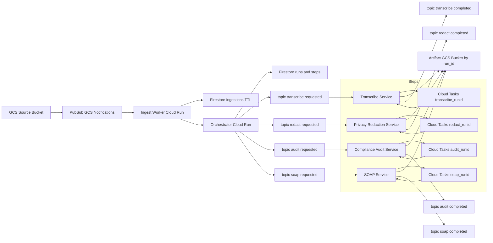

# System Architecture

This repository implements a Google Cloud–native, event-driven pipeline for ingesting media, transcribing, redacting, auditing for HIPAA compliance, and generating SOAP notes. It uses Pub/Sub, Cloud Run, Cloud Tasks, Firestore, and GCS. The system is designed for correctness (idempotency), robustness (retries, DLQ), and security (OIDC between services).

## High-Level Diagram

Legend:

- Node types
    - Ingest Worker / Orchestrator / Transcribe / Privacy / Compliance / SOAP: Cloud Run services (FastAPI)
    - Topic …: Google Pub/Sub topic (e.g., transcribe-requested, audit-completed)
    - Cloud Tasks …: Cloud Tasks queue (deterministic task names: <step>-{run_id})
    - Firestore …: Firestore collections (ingestions, runs + steps); TTL enabled where noted
    - Artifact GCS Bucket by run_id: Shared Google Cloud Storage bucket where all step artifacts are stored/read using run_id as the key

- Edge labels (what each arrow means)
    - GCS event: Object finalize notification from GCS to Pub/Sub
    - push (OIDC): Pub/Sub push delivery to a service endpoint (/events/pubsub) with an OIDC bearer token; audience must match the exact URL
    - HTTP (OIDC) POST /run: Synchronous Cloud Run-to-Run call using a Google-signed identity token; audience = target URL
    - write / read / read/write: Data written to or read from Firestore or the Artifact bucket
    - publish: Service publishes an event to the corresponding Pub/Sub topic
    - enqueue: Service creates a Cloud Task (HTTP target)
    - dispatch (OIDC): Cloud Tasks delivers the HTTP request (e.g., /tasks/<step>) with OIDC auth

- Retry semantics (platform-driven)
    - Pub/Sub push
        - 2xx: ack and delete message
        - Non-2xx: automatic retry with backoff; message moves to DLQ after maxDeliveryAttempts if configured
    - Cloud Tasks HTTP target
        - 2xx: success; task deleted
        - 4xx (not 429): permanent failure; no retry
        - 5xx or 429: retry per queue policy (min/max backoff, max attempts)

- Idempotency and ordering
    - Global idempotency key (run_id): sha256(bucket/name@generation|session_id)
    - Cloud Tasks: deterministic task name <step>-{run_id} prevents duplicate enqueues
    - Pub/Sub: message ordering enabled; ordering_key = run_id ensures per-run sequence

- Security (OIDC and IAM)
    - Pub/Sub push → Cloud Run: OIDC token with audience set to exact push endpoint; push SA must have Cloud Run Invoker on the target service
    - Cloud Run → Cloud Run: identity token minting (audience = target URL)
    - Cloud Tasks → Cloud Run: OIDC token using a caller service account (with Cloud Run Invoker on the target); audience = service base URL
    - Principle of least privilege: services scoped to only required Pub/Sub, Firestore, and GCS permissions

- Observability
    - Logging: structured JSON logs with correlation fields (x-correlation-id, x-idempotency-key, run_id); avoid logging PHI—log lengths/hashes instead
    - Tracing: OpenTelemetry spans exported to Cloud Trace across Ingest, Orchestrator, and /tasks/<step> handlers
    - Metrics: monitor QPS, latency, error rates, queue depth, DLQ counts in Cloud Monitoring

- Timeouts and resilience
    - Keep dependency timeouts < Cloud Run request timeout < Pub/Sub push timeout
    - Use Cloud Tasks for long-running or spiky workloads; keep client-side retries minimal (0–2 quick attempts) to avoid retry storms

